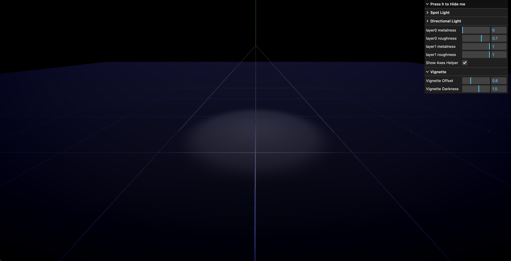

# GRID Module

## Setup



### Installation

```bash
# Clone the repository
git clone https://github.com/GHeart01/Grid-module-demo

# Navigate to project folder
cd Grid-module-demo

# Install dependencies (only the first time)
npm install

# Install lil-gui for controls
npm install lil-gui

# Run the local server at localhost:8080
npm run dev

# Build for production in the dist/ directory
npm run build